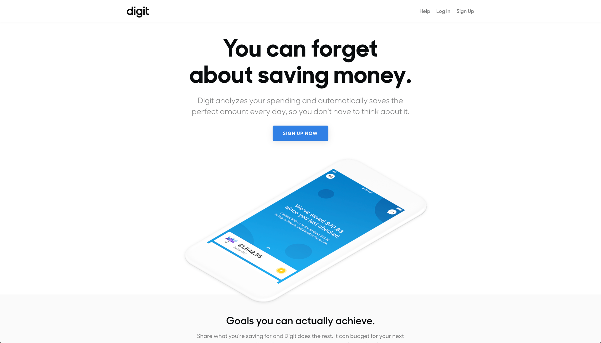
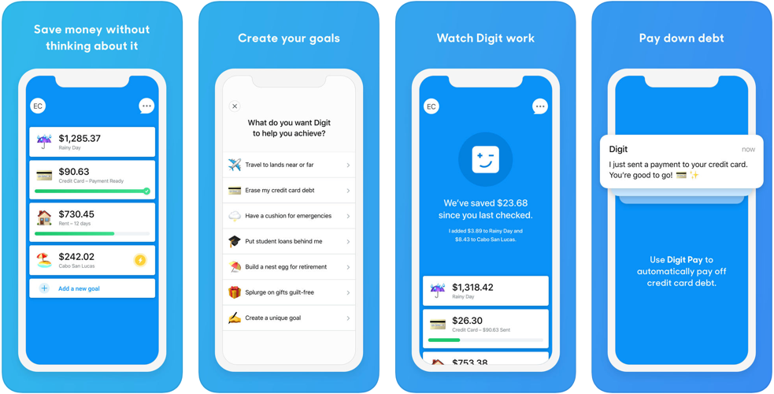

# Digit

[Digit](https://digit.co/) was a pioneer in the digital savings space and their app continues to provide a solid and automated approach to savings.  The ethos of the application is to link your main checking account to the application and let their software analyze your spending habits and then sneak small transfers out of that account into savings accounts.  The first application from Digit wasn't an app at all - it was a chat bot. One of the first examples of a utility offering functionality purely through text message, you could simple ask questions about your savings balances or your checking account to a number and they would text you back with responses - no application needed.  Their current offering takes the chat functionality and houses it in clean app where you can still complete all of the same requests, but now instead of using sms, you are able to type inside of a stand-alone application where they can offer suggested actions and commands.  The app is well done, but if you liked the classic functionality, that is still supported and you can text away.

## In Brief

* Straight forward application automatic savings towards specific goals
* Chat bot-style interface


**Pro Tip:** description


## Is this app for me?

Do you want to passively save for things?  This application is meant to get you from never saving, to saving small amounts and for that it is quite good.  If you are trying to do complex savings arrangements with triggers and or budget functionality, this is not the app for you but if you are looking for a painless way to save a bit of money without having to think much about it, this is a very useful solution.

## What does it do?

* Analyzes your main checking account for patterns in the movement of your money and then sneaks small deposits from that account to build up savings for goals.
* Allows you to accumulate money for a specific goal or to pay a bill from the application (i.e. credit cards)

## What it lacks

This application was meant to get people to save more money with as little complexity and or interface as possible.  Because of that goal, you aren't able to do many complex transactions.  For instance if you want to save every time X occurs, you won't be able to do that with Digit.  Also, the app doesn't provide any budgeting information, the ability to send money to others or to pay for things directly out of the application like some other applications.

## How to get started

1. Download the application from the app store
2. Onboarding screens will prompt you to setup a new account using either your mobile number or email address
3. Then you will like your main checking account to the application using your online banking credentials and you are all set to go
4. With your account established, without any additional instructions, Digit will start to pull money from your checking account into a newly established savings account for you, after about three business days

## App Ratings and Details

The application is well reviewed on both the iOS and Google Chrome stores, with 85K 5-star reviews and 15k 5-star reviews, respectively.
