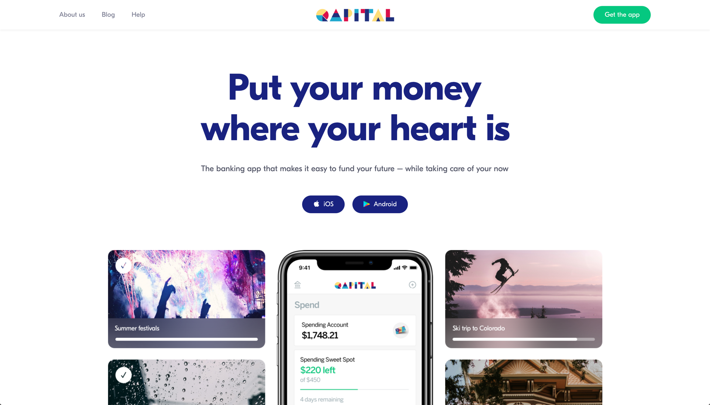
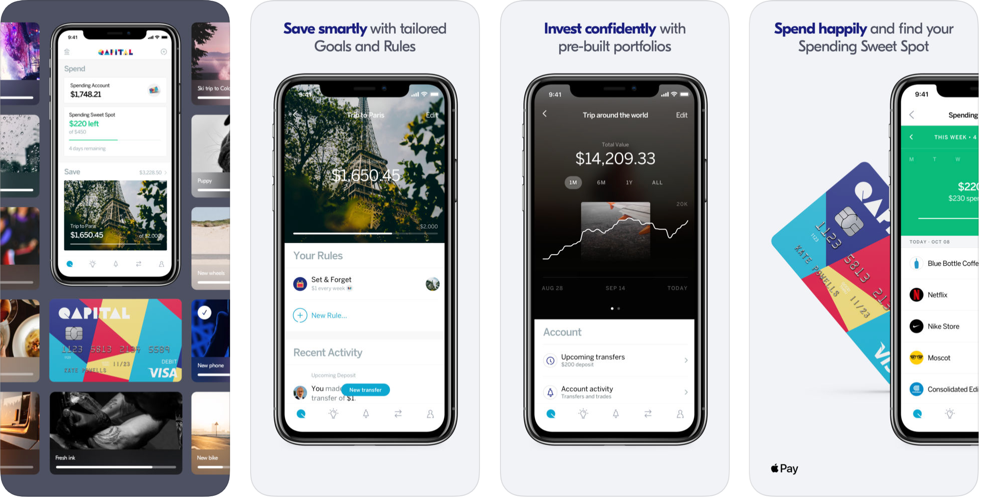

# Qapital

Qapital is a mobile application with savings and investing at its core.  Use it to establish a new account, which comes with its own connected debit card, setup savings targets and then fund those targeted goals with triggers and actions.  Through clever notifications and rules you can keep track of your spending on various categories and effortlessly build up an investment portfolio, small amounts at a time.

## In Brief

* Savings app which uses rules to fund goals.
* Included associated debit card and investment account
* Set and forget savings for everyone.


Pro Tip:


## Is this app for me?

Qapital it great for someone that is trying to start small with both savings and investing.  If you would rather saving a few dollars at a time based on your activities than larger amounts all at once, Qapital makes that process quite simple and in no time you will accumulate meaningful funds.

## What does it do?

* Setup individualized savings accounts for specific goals (trips, purchases, etc.)
* Select rules which will help fund those goal accounts (i.e. "If I buy gas, put $5 to my 'car' fund")
* Spend the funds saved through your debit card or invest those funds through included investment products.

## What it lacks:

Qapital investment products are not for professionals. You tell Qapital how much are you are going to save and when you want to spend it and they tailor a portfolio for you, however you won't get much viability into the funds themselves.  If you do not sign up for the debit card offering you are unable to monitor spending and or spend the saved funds without transferring them back to your checking account.

## How to get started:

1. Download the Android or iOS application from their respective stores.
2. Add your relevant credit cards and checking account.
3. Create a goal and then create rules to fund those goals.

## App Ratings and Details:

Both the Android and iOS versions of the application are highly rated, however there is no web app available at this time.
