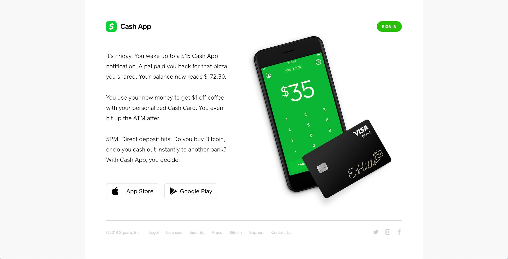

# Square Cash

The [Cash App](https://cash.app/) from Square, is aimed at making the transfer of funds as simple and fast as possible.  With functionality familiar to those that use Venmo, Cash allows you to connect your checking account as a source of funds and then distribute those funds to contacts in your phone or have those same contacts request money from you or even businesses instantly.  Additional functionality allows the other to convert USD to BTC and back without a fee.  Cash also allows you to open up a debit card account which will allow you to access physical cash held in your linked account.

Designed to be as straight forward to use as possible, the Cash app is on a mission to replace physical cash, and at that goal it succeeds.

## In Brief

* Receive and send funds to friends; pay for things at merchants
* Convert USD to BTC without a fee, instantly
* Use the connected debit card to pull funds from ATM


**Pro Tip:** description


## Is this app for me?

The Cash app from Square is designed to fit a very specific need.  If you commonly need to send funds between people, it provides a robust and straight forward interface, with the ability to use BTC which is a nice additional feature.  If you don't have a phone equipped with something like NFC payments, Apply Pay, Samsung Pay etc., Cash could provide similar functionality will adding the bonus of BTC functionality.  If you already have Venmo and Apple Pay, many of the features on offer would be duplicating existing functionality.

## What does it do?

* Allows a user to send and receive funds instantaneously to both friends and businesses
* Seamless conversion of USD to BTC and back without a fee
* Connects your digital funds to physical ones through the use of a debit card
* If you use the debit card you can receive discounts for specific vendors

## What it lacks

In short - it lacks a killer feature. Instant settlement on BTC transactions is appreciated but not unheard of. There aren't budgeting features and the only automation is to refill your account at scheduled intervals. Because of the simplicity of the application, it does force you to do many other financial related operations using a different service.

## How to get started

1. Download either the iOS or Android version of the application for your phone.
2. Launching the app will prompt you to enter a phone number.
3. You will receive a code which you will use to authenticate the app for that device.
4. Next you will be asked to enter a card number (you can skip this for now but will need to link to a financial institution later to fund your Cash account.
5. Enter your full name and zip code for verification.
6. Choose your "CashTag" which is basically a handle, which allows others to find you so that they can send you funds.
7. Request a debit card for the account if you would like one, otherwise you should be set to go send and receive money from people and institutions.

## App Ratings and Details

The Cash app has a 4.6 rating on iOS with 146K reviews and a 4.0 rating on Android with 63K reviews.
