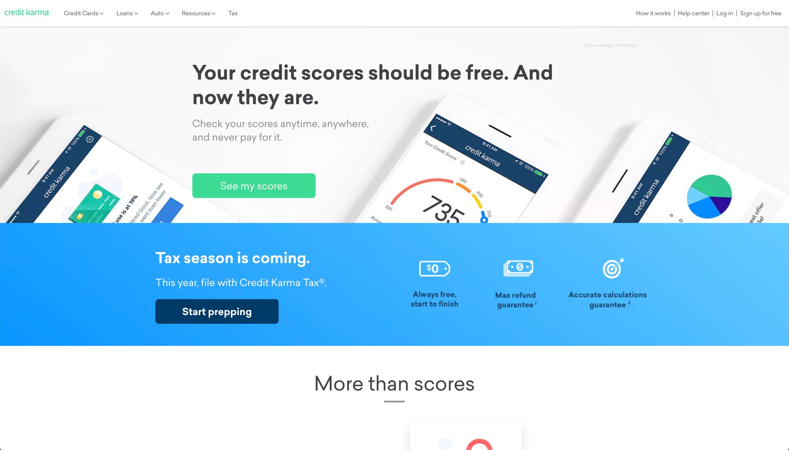
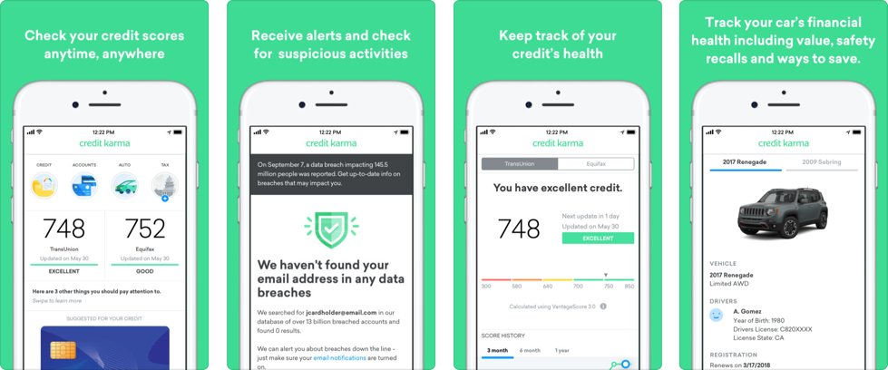

# Credit Karma

It's pretty ridiculous that you can only get one free credit report each year, especially since your scores can change month-to-month.

Luckily, [Credit Karma](https://www.creditkarma.com/) makes it easy for you to check in on your TransUnion and Equifax scores as many times as you want. The app also enables you to quickly view all of your active banking and credit card accounts, see what's impacting your credit score, and discover your home buying power.

This definitely isn't a budgeting tool, but it is a great supplement to use alongside another app that helps you manage your money.

## In Brief

* Item
* Item
* Item


**Pro Tip:** description


## Is this app for me?

If you want to gain deeper insight into the state of your credit score, as well as how you can improve your car, home, and credit card interest rates, this is a great tool. Use it alongside your personal budgeting app of choice. Having more awareness of your credit score is an important starting point as you make changes toward improving it.

## What does it do?

* Check in to see what your credit scores are via TransUnion and Equifax as often as you'd like.
* Discover what factors are impacting your score, and simulate what your future score could be.
* Manage your car value and insurance costs so you're always getting the best rates.
* Discover your home buying power by calculating your income, down payment, and credit score.

## What it lacks

Unlike many of the other apps listed in this guide, Credit Karma is not a budgeting app. You can't use it to manage your money specifically. It is a supplemental tool to be used with other financial management apps, but centers more around financial literacy and awareness rather than personal money management.

## How to get started

1. It's pretty easy to get started with Credit Karma. It takes about 5-10 minutes to input your personal information, which will then give you access to your credit scores, accounts, and available credit.
2. Once you sync your accounts, you're free to browse through Credit Karma's suite of tools, including: a credit score simulator, auto insurance rate checks, financial calculators, and tax reform impact.
3. It's fairly easy to set up initially, as well as use after the initial account sync.

## App Ratings and Details

Text

