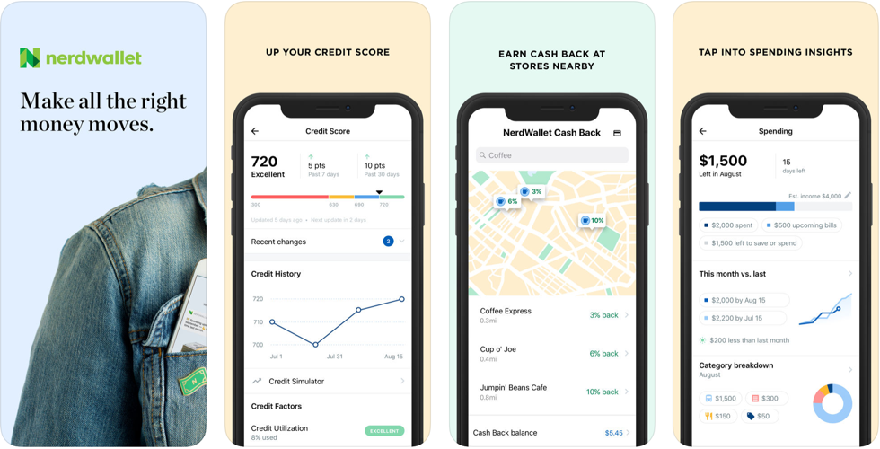

# NerdWallet

[NerdWallet](https://www.nerdwallet.com) has long been the go-to destination for advice, reviews, and recommendations for financial products and services from credit cards to mortgages. Their website continues to be packed with relevant and valuable content – check out their "Best Of" or "Comparison" sections for help on deciding which account to sign up for. As a NerdWallet member, you can also take advantage of their financial tools to manage your credit score, track spending, or find ways to save through their web and mobile apps.

## In Brief

* Get expert advice and analysis on the best financial products and services.
* Free credit reports and basic spend tracking for NerdWallet members.
* Publishes a ton of great articles on personal finance.


**Pro Tip:** Use NerdWallet's website to learn about that new travel credit card you might want and the mobile app for tracking your financial picture from a high level.


## Is this app for me?

If you want a swiss army knife for your finances, NerdWallet is for you. The app has tracking for your Credit Score, Spending, and Home Value. It's great for seeing the big picture and getting a wide variety of "tips from the Nerds."

## What does it do?

* Review your TransUnion Credit Score and simulate your credit into the future.
* Track your spending month to month across bills, cash flow, and top places breakdowns.
* Get cash back by linking a credit or debit card and finding deals based on your location.
* Browse offerings for Credit Card, Loans, Investment Accounts, and Bank Accounts.

## What it lacks

We've found the content and comparisons that NerdWallet develops to be the most valuable aspect of their offerings. If you agree, the app is going to feel a bit light. Luckily they offer both! But the app \(web and mobile\) can help you with other aspects of your "money moves." More specifically, it's important to note that the Credit Score feature only pulls data from **one** of the two major credit score reporting agencies.

## How to get started

Whether you decide to sign up through the web or mobile app, onboarding with NerdWallet is really easy, especially if you decide to authenticate with your Google account. The apps also show mock data in each section so you can get a great sense of what it has to offer before connecting your bank accounts!

1. Sign up with email or Google.
2. To connect your bank account\(s\), you'll first need to verify your identity with an SMS code.
3. Request your Credit Score \(free\), connect your bank accounts, or enter your home address \(for home value estimate\) with a few clicks.

## App Ratings and Details

NerdWallet is available on the web as well as both iOS and Android. Both have high ratings and frequent updates.



The iOS version is frequently updated and offers a well designed user experience, including all the features described above.

| Rating | Price | Frequency of Updates |
| :--- | :--- | :--- |
| 4.8 / 5.0 ⭐ | Free | Regular |


[Download](https://itunes.apple.com/us/app/nerdwallet-credit-score-cash/id1174471607?mt=8)




The Android version is frequently updated and offers a well designed user experience, including all the features described above.

| Rating | Price | Frequency of Updates |
| :--- | :--- | :--- |
| 4.6 / 5.0 ⭐ | Free | Regular |


[Download](https://play.google.com/store/apps/details?id=com.mobilecreditcards&hl=en_US)




The website app offers a similar if a little more basic version of what's available in the mobile apps. Note that you don't have to be logged in to take advantage of their articles and Best Of guides!


[Get Started](https://www.nerdwallet.com)



