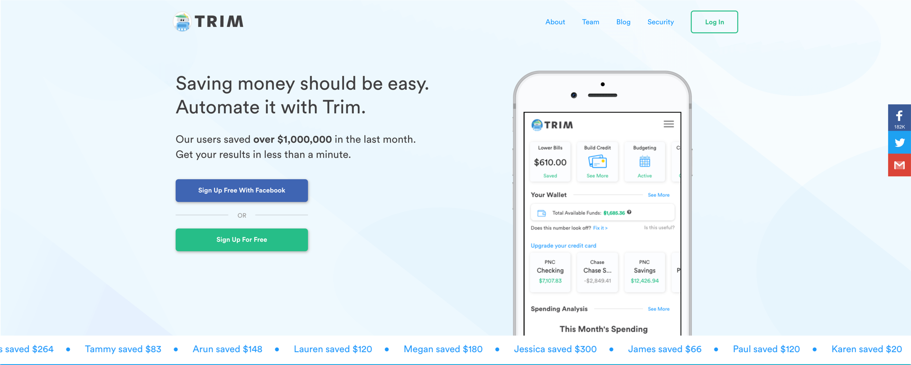

# Trim

In the world of modern commerce, the modern subscription service is the grail.  Get $100 from someone once - well done you.  Get $10 a month from someone forever - go by an island.  We all sign up for these services, but we almost never view them in aggregate - a number that is often far larger than we expect.

[Trim](https://www.asktrim.com/) has set out to develop product offerings that help people to manage their growing list of subscriptions.  By connecting your main checking account to the service, they are able to capture recurring charges and then using a chat interface, can help you to cancel them.  They are also able to negotiate certain bills on your behalf, like your cable bill which some how got to be $200 a month.  They offer spend tracking and also automated savings like many other apps, but at their core the application is about reducing the number of monthly hits to your account for services you likely don't need - and that that they are quite good.

## In Brief

* Find and analyze your monthly recurring charges (subscriptions)
* Negotiate better deals with certain vendors based on usage
* Automated savings


**Pro Tip:** description


## Is this app for me?

Probably.  Even the most fictitious finance guru has probably signed up for something that hits their account ever month and doesn't remember it.  This service makes it simple to hunt down those cards and take action to reduce or eliminate them. You won't be able to run your financial life from the application, but for specifically dealing with recurring charges, it provides a great tool for a known problem.  

## What does it do?

* Scans your accounts (mainly checking) for recurring charges
* Highlights them to use as an opportunity to save money on a monthly and annual basis by removing them
* Negotiates lower rates on bills you might need to keep (like cable)

## What it lacks

This is not a budgeting app or is it some new kind of checking account.  Trim is mission specific and everything else is secondary.  You won't find person to person transfers or credit scores but you will get help with recurring charges.

## How to get started

1. You can setup the service from their website (asktrim.com)
2. You will then pick a message service (facebook or sms) which will be how you interact with the service as they review your accounts.
3. Then pick any other services you may want (both savings app and bill negotiator have fees)
4. Connect your bank accounts for analysis and you are set to go

## App Ratings and Details

Because Trim isn't an application but is instead a bot, it is not listed for review in either iOS or Android stores, however other reviewers seem to appreciate it's interface and functionality.
