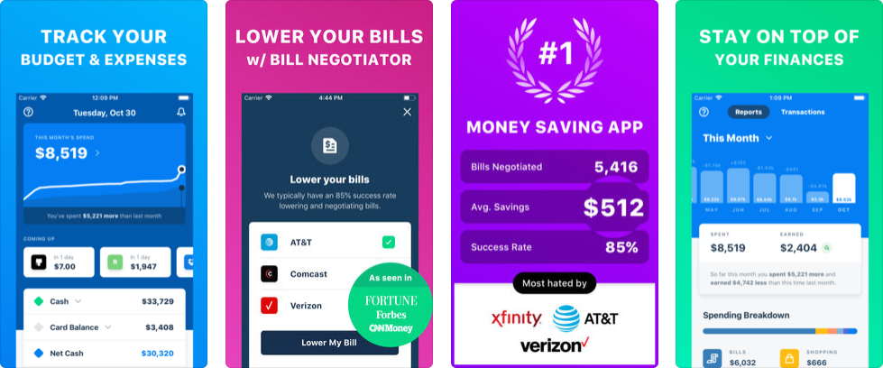

# Truebill

The [**Truebill**](https://www.truebill.com/) app helps you find all of your subscriptions and cancel unwanted services. Use it if you want to know exactly how much you're being charged every month for recurring bills like gym memberships, cell phones, entertainment streaming services, and utilities. Those $5 and $10 monthly subscriptions add up, and you shouldn't pay for services you aren't using regularly. Truebill helps you track recurring expenses across time and quickly cancel memberships you no longer want. It also gives you the information you need to lower inflated \(but necessary\) bills, like your cell phone and cable services.

## In Brief:

* Stay on top of your bills and subscriptions.
* Standard graphs and reports for your finances.
* Have Truebill negotiate your bills on your behalf for some services.


Truebill's app is user friendly and offers a number of ways to analyze your spending and find savings. Their bill and subscription identification is spot on and plotted on a calendar, so you can see what's been paid and anticipate what bills are upcoming.


## Is this app for me?

Truebill is great for anyone who has a lot of subscriptions and/or bills and wants to manage them better. If you feel like you don't know where your money is going each month, it may be due to your autopay subscriptions. Use this app to help you identify where you can save by lowering bills – or cancelling some subscriptions entirely.

## What does it do?

* See all of your expected recurring payments on a calendar list each month so you always know what bills you'll get hit with on any given day
* Get a quick glance at how much you've spent so far this month, as well as how it compares to your spending from the previous month
* Use the built-in concierge service to negotiate lower bill rates and cancel unwanted subscriptions on your behalf for a fee

#### Interested in the Premium version? 

Truebill allows you to choose your own price \($3 - $12 / month\) for the following additional features:

* Have Truebill cancel your pesky subscriptions automatically
* Custom categories for your transactions
* Automatic savings program
* Overdraft and Late Fee negotiation
* Premium Chat
* On demand account syncing

## What it lacks:

Out of the box, the Truebill app isn't a detailed budgeting or financial management app. Beyond the app's hands-on concierge service, which will help you lower and cancel your bills, this is more of a personal finance analysis tool that looks specifically at your recurring bill and subscription spending rather than your overall \(including variable\) spending.

## How to get started:

We found it fairly easy to get started with Truebill. Here are the two main onboarding steps:

1. Connect any \(or all\) of your banking and credit card accounts. You can connect just one to get started, but you don't really see the true picture of your spending and recurring subscriptions unless you connect all of them.
2. If you want to have a Truebill representative lower bills on your behalf \(and you're okay with them charging you 40% of the negotiated savings\), just upload the bill you want to lower and send it to the team. Easy as that.

## App Ratings and Details:

Truebill is available on both iOS and Android, both of which have high ratings and frequent updates.



The iOS version is frequently updated and offers a well designed user experience, including all the features described above. 

| Rating | Price | Frequency of Updates |
| :--- | :--- | :--- |
| 4.7 / 5.0 ⭐ | Free, with in-app purchases | High |


[Download](https://itunes.apple.com/us/app/truebill-budget-bill-tracker/id1130616675?mt=8)




The Android version is frequently updated and offers a well designed user experience, including all the features described above. 

| Rating | Price | Frequency of Updates |
| :--- | :--- | :--- |
| 4.1 / 5.0 ⭐ | Free, with in-app purchases | High |


[Download](https://play.google.com/store/apps/details?id=com.truebill&hl=en_US)




The website version offers a very basic summary of your Subscriptions, Bills, and Utilities.



