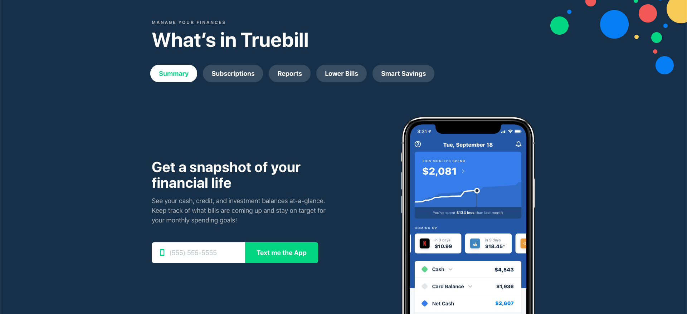

# Truebill

The Truebill app helps you find all of your subscriptions and cancel unwanted services. Use it if you want to know exactly how much you're being charged every month for recurring bills like gym memberships, cell phones, entertainment streaming services, and utilities. Those $5 and $10 monthly subscriptions add up, and you shouldn't pay for services you aren't using regularly. Truebill helps you quickly cancel memberships you no longer want. It also gives you the information you need to lower inflated \(but necessary\) bills, like your cell phone and cable services.


Learn more about [Truebill](https://www.truebill.com/)

