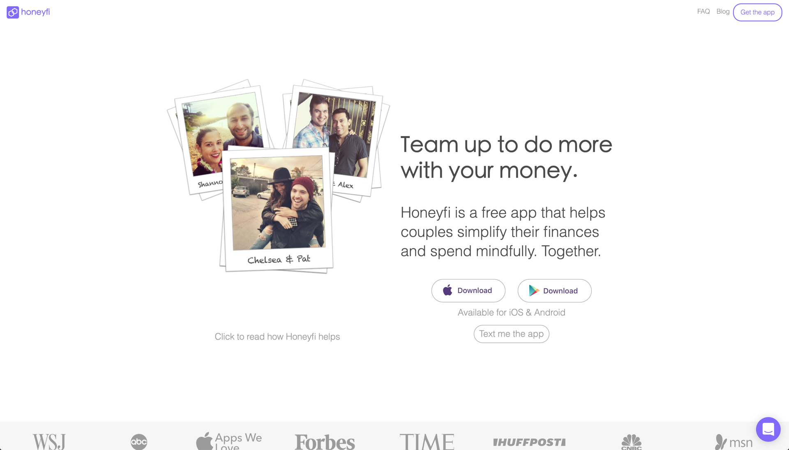
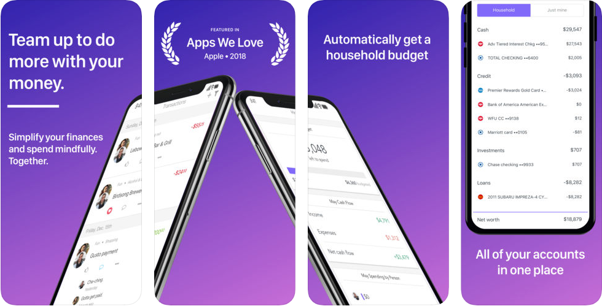

# Honeyfi

If you're in a relationship, [**Honeyfi**](https://www.honeyfi.com/) is worth checking out. In our experience \(and we're willing to bet you can relate\), being in a relationship adds a layer of complexity to your finances. There is more to balance \(literally\), more coordination required for bill repayment, and different \(usually bigger\) financial goals to work toward.

## In Brief

* Define which accounts should be shared or not with your partner, with a high degree of fidelity.
* Track spending by person, by category, or by bill.
* Save money together with Honeyfi Goals for big life goals.
* Review transactions, add comments, or request funds from your partner by Venmo.
* Take advantage of a partnership with BillShark to negotiate your bills \(\*you pay 40% of the savings as a fee\).


**Pro Tip:** We think Honeyfi is a solid option if you want to stay on top of your spending, manage bills, and accomplish goals alongside your partner. Don't worry: You can control what you share with your partner, so this can work for you – whether you've been together for 6 months or 60 years.


## Is this app for me?

HoneyFi was specifically built for people in relationships. If that happens to be you and your finances have felt out of wack lately, this is worth giving a try. Use it to keep track of spending, pay bills in unison \(and on time!\), and work toward your most important financial goals together. This app will help couples get on the same page about money.

## What does it do?

* Based on your previous spending, the app will automatically suggest a household budget. You can edit it and track your budget however you want.
* Create specific budgets based on category so you know how much you have left to spend- both as a couple and individually.
* Share as much or as little as you want. You can track individual and joint accounts together or separately. You can handpick specific transactions to share while keeping most of your spending and saving private.

## What it lacks:

If you aren't in a relationship – or don't want to share anything about your finances if you ARE in one – this app isn't for you. Additionally, while there are some automated insights and suggestions built into the app, there is still a degree of manual setup work you need to do with your partner. And we think that makes sense – since every couple is unique, every budget will be different.

## How to get started:

Setup takes about five minutes with Honeyfi. Here are the steps in a nutshell:

1. Create a user profile – basic stuff like your email address, name, and phone number.
2. Enter your partner's information \(with permission first, of course\) – all you need to provide is a name and email address for your partner.
3. Link one or all of your accounts to the app.
4. Decide what you want to share with your partner.

## App Ratings and Details:

Honeyfi is available on iOS and Android, both of which have good ratings and regular updates.



The iOS version is maintained regularly and offers a wide variety of features as described above.

| Rating | Price | Frequency of Updates |
| :--- | :--- | :--- |
| 4.3 / 5.0 ⭐ | Free | Regular |


[Download](https://itunes.apple.com/us/app/honeyfi-couples-finances/id1156761013?mt=8)




The Android version is maintained regularly and offers a wide variety of features as described above.

| Rating | Price | Frequency of Updates |
| :--- | :--- | :--- |
| 4.3 / 5.0 ⭐ | Free | Regular |


[Download](https://play.google.com/store/apps/details?id=com.honeyfi.app)



