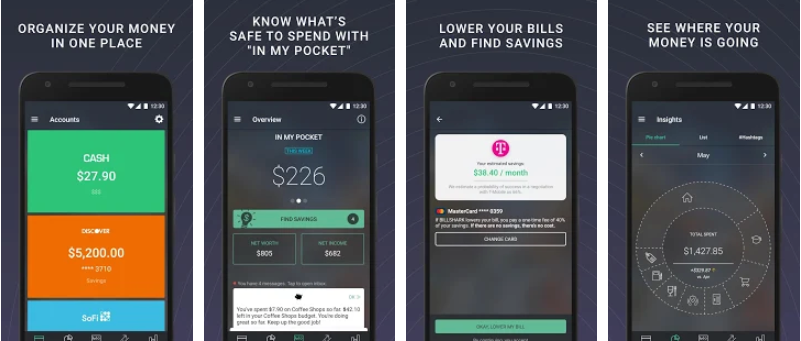

# PocketGuard

[**PocketGuard**](https://pocketguard.com/) allows you to automatically sync your financial accounts- from checking and savings accounts, to loans, to mortgage payments. As a result, you can quickly see where you stand and track your current and future net worth.

Your budget is also built automatically based on your earning and spending patterns \(which can be useful or a pain, depending on how hands-on you want to be\). Finally, the app has built-in "Find Savings" options. While this section can be useful, proceed with caution and do your research before choosing any of the investment, refinancing, insurance, and credit card suggestions.

## In Brief

* Connect all your accounts in one place and track net worth.
* Use "pockets" to know how much you have spent and can spend on certain categories.
* Get a budget built for you automatically based on your spending and earning patterns.
* Browse suggestions for lowering your recurring bills. 


**Pro Tip:** One of the best PocketGuard features is the "In My Pocket" function, which shows you how much you can safely spend every day, week, and month once your bills and savings have been accounted for.


## Is this app for me?

PocketGuard is a great option for those who want an automated budgeting tool. This is a future-focused app that lets you know how much you can safely spend on any given day, week, or month without getting yourself into trouble when it's time to pay bills.

## What does it do?

* Get an automatic glimpse at how your spending is tracking month over month.
* Add in your credit card, bank, loan, investment, cash, and property balances to get a true picture of your current and projected net worth. The app syncs with 18,000 banking institutions, so it's fairly comprehensive.
* Use the "Find Savings" function to lower your bills, start investing, get insight on your credit score, refinance high-interest debt, and more.

#### Interested in the Premium version?

For a $3.99 monthly subscription \(or $34.99 annually\), PocketGuard Plus lets you track your money with even finer detail:

* Track the cash you spend or receive
* Plan for bills you pay in cash
* Know how much cash is in your pocket

## What it lacks

PocketGuard has the opposite challenge that more manual apps like Wally and HomeBudget have. Since all of your synced account information uploads automatically, you have to manually go into each transaction that you don't want to include in your budget overview.

## How to get started

Here's how to get started with PocketGuard:

1. Connect any \(or all\) of your banking and credit card accounts. It's best to connect all of them so you can get a true picture of your available income.
2. The app automatically uploads your monthly income, bills, savings, and net worth. Check out the "Overview" and "Insights" tab to get a more in- depth look at how much you earn and spend each month, how your spending is trending month over month, and what your current net worth is.

## App Ratings and Details

PocketGuard is available on iOS and Android, both of which have regular updates. The iOS version is more highly rated.



The iOS version is maintained regularly and offers a wide variety of features as described above.

| Rating | Price | Frequency of Updates |
| :--- | :--- | :--- |
| 4.8 / 5.0 ⭐ | Free, with in-app purchases | Regular |


[Download](https://itunes.apple.com/us/app/honeyfi-couples-finances/id1156761013?mt=8)




The Android version is maintained regularly and offers a wide variety of features as described above.

| Rating | Price | Frequency of Updates |
| :--- | :--- | :--- |
| 4.4 / 5.0 ⭐ | Free, with in-app purchases | Regular |


[Download](https://play.google.com/store/apps/details?id=com.honeyfi.app)




