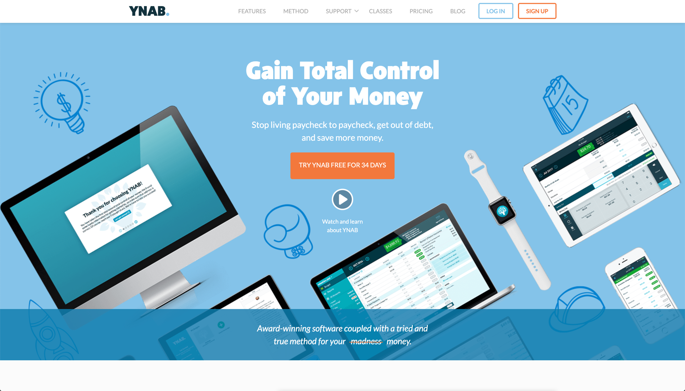
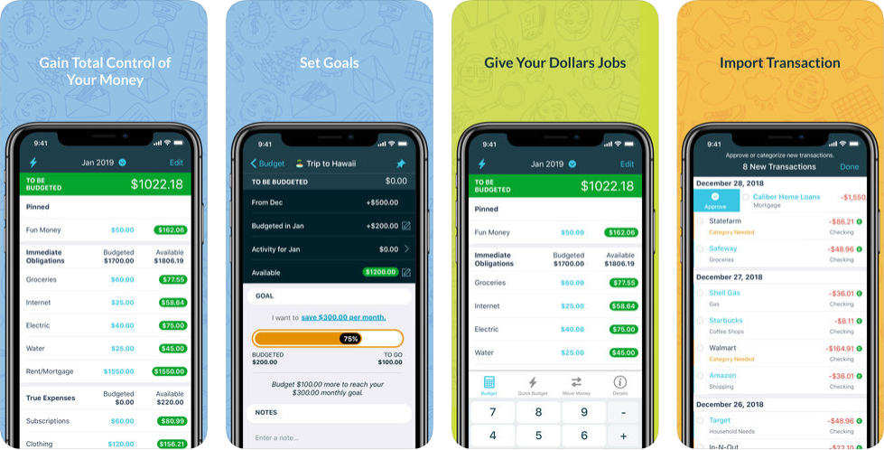

# You Need a Budget

The You Need a Budget \([**YNAB**](https://www.youneedabudget.com/)\) app is built around four rules:

1. Give every dollar a job
2. Embrace your true expenses
3. Roll with the punches
4. Age your money

In essence, this means creating a budget that helps you spend money you've earned at least a month ago so you don't have to live on the financial edge. No more timing your bills with paychecks, wondering how much money is in your account, or running out of cash before the next payday. By assigning a specific task for all inbound funds, you can allocate to savings in the same way that you allocate funds for rent, feeling confident that you will be able to support both with the funds that you have.

The goal of the application, to get everyone to have a budget is a noble one, but this application requires work - active monitoring of your expenses and budgets. To utilize this application properly, you should set specific time aside in your day or week or ensure that items in the application are up to date.

Like many other applications, YNAB is on a specific mission to get you a budget so that you can organize and better manage your personal finances, but to be sure, you will need a few other applications to fill out all of the functions you might need in day to day financial management.

## In Brief

* Look at your finances on a monthly basis, but line item, assign a value and then track against those values.
* Will force you to look at where your money is going but might not help you do anything about it.
* Requires maintenance to stay up to date with your finances (not purely automated)
* Has a small $7 per month / $84 per year charge for the service


**Pro Tip:** description


## Is this app for me?

If, like most Americans, you live paycheck to paycheck but wish to change the habit, YNAB could be a great option for you. Making the best use of this app requires a transformation of how you think about the flow of your money, but the platform is built specifically to get you in a position where you're not living on the edge financially.

## What does it do?

* Connect your bank accounts with YNAB so you always know how much you have to work with.
* Set up your spending and saving categories, and give every dollar a job in any given month.
* Build in goals for long-term or one-time expenses down the road so you can start saving now.
* Track your category-based budget goals each month, and easily move your money around if you overspend or underspend in a particular area.

#### How much does it cost?

description

## What it lacks

This is a fairly manual app when it comes to tracking expenses and balancing your budget. If you're not into daily or weekly budget management, this may not be the app for you. It's also important to understand the philosophy of giving every dollar a job. If that rule makes you too uncomfortable, you probably won't like YNAB.

## How to get started

1. The best way to get started with YNAB, like many of the other apps listed in this guide, is to sync all of your bank accounts so you know exactly how much money you have to work with each month.
2. Then, set up your categories \(or work with the automatic ones if you want to get started quickly\) and set budgets for each one. It'll probably take you a while to figure out what the right amount is for each bucket, but YNAB makes it easy to iterate as you go.
3. Finally, input your debts so you can use YNAB to put any excess cash each month toward repayment.

## App Ratings and Details

YNAB has a 4.8 star rating and 8.8K reviews on iOS and 4 stars from 4K reviews on Android.
