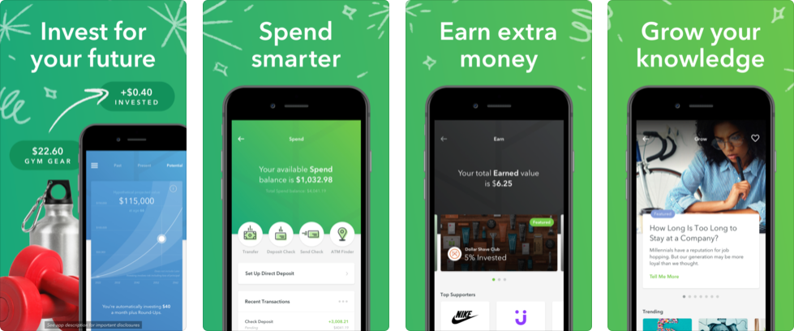

# Acorns

[Acorns](https://www.acorns.com/) is a mobile-first savings and investment platform, aimed at people new to investing.  The origins of the application were in savings, where a user would link their accounts to the application and as the user bought things, the application would round up of all the expenses to the nearest dollar and then deposit those funds in a savings account.  The team at Acorns built on that idea and now offers a complete money management solution with integrated checking account and investment portfolios to help people go from little or no savings to a growing investment account with as little friction as possible.  If Digit and Betterment had a kid, it would be creatively named Acorns.

## In Brief

* Round-up based savings
* Low-cost ($2/month) investment portfolios using money saved through micro transfers
* Connected checking account if you want one ($3/month)


**Pro Tip:** description


## Is this app for me?

Do you systemically save money and then invest said money into investments based on a rigorous self assessment of your financial goals and risk tolerance?  If yes, it sounds like you are pretty ahead of the curve and probably don't need to use Acorns.  As for the rest of us, Acorns is a great way to get into investing a very low cost to play.  I particularly appreciate that their investment portfolios are comprised of low cost ETFs which provide diversification, in contrast to other apps which would like you to invest in specific equities.  If you aren't doing this sort of financial management yourself, Acorns is a great way to start.

## What does it do?

* Automated savings
* Investment accounts with saved funds for a small fee
* Advanced checking account to help with savings and round-ups for a slightly less small fee

#### How much does it cost?

description

## What it lacks

Acorns is for the novice saver.  With the app, you won't be able to buy shares of a new tech company, or place stop-loss orders on stocks you already own.  This is about saving money and then responsibly investing that money for the long term.  You also won't find budgeting or cashflow management tools in Acorns - effectively taking the savings and investment component of your financial life and removing it from your spending habits.  Great at its core goal - definitely for beginners.

## How to get started

1. Download and install the application
2. Complete the onboarding process including an assessment of your investment profile (if you decide to setup an investment account).
3. Link your associated accounts and you are all set.

## App Ratings and Details

Extremely well reviewed with 365K reviews and 5 stars on iOS and 63K reviews and 4.9 stars on Android.
