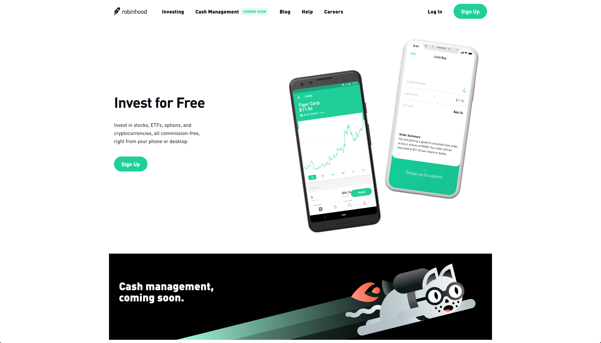
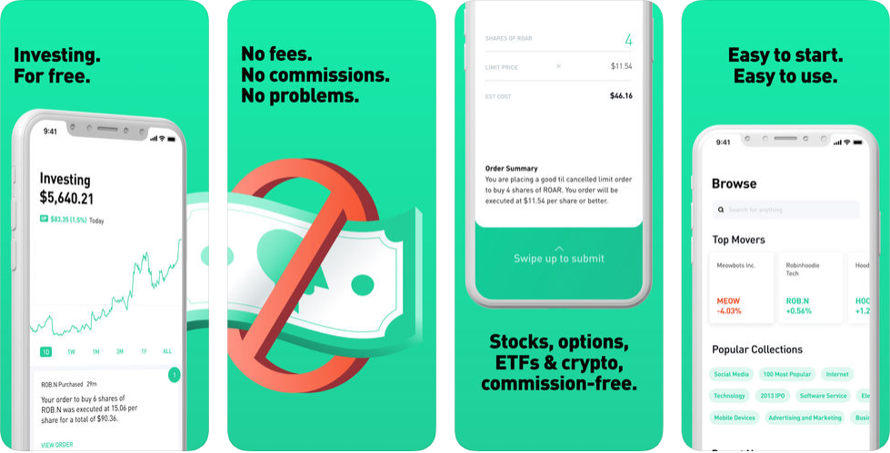

# Robinhood

[Robinhood](https://robinhood.com/) aims to make investing accessible for everyone.  In a world where incumbents like Etrade and Scottrade offer $7-10 per trade fees for equity trades, Robinhood leveraged the movement to electronic trading and settlement and passed the savings to the consumer.  Signing up for the Robinhood app is straightforward and after funding your account you will quickly be able to buy a sell most US-listed equities.  If you would like to use a bit of leverage to buy additional investments, credit lines are available for a monthly fee at various levels.  Newly added to the application is the ability to also buy crypto currencies, again without paying on either end for a transaction fee.  If you want to get a bit creative with your trading strategies, Robinhood can accommodate, providing limit, stop-loss, stop-limit and market order options on any given trade.  Not designed to be a complete wealth management solution, Robinhood does provide a well-designed platform for the average investor to invest in US equities with as little expense as possible.

## In Brief

* No fee equity trades
* Buy crypto currency with USD for free
* Not a wealth management tool


**Pro Tip:** description


## Is this app for me?

I appreciate a simple premise well executed and Robinhood is just that.  Free equity trading for all.  If you have the need to frequently (both not day trade) stocks, Robinhood is a great choice.  Additionally, if you have a hunch about a company and only want to buy a few shares, Robinhood makes that quite simple and by removing the trading fee, can make your small bet pay off far faster.  If you are looking for one finance app to manage your net worth, make stock recommendations and optimize your cashflow, Robinhood is not the app for you.  It knows what it is and does that role quite well.

## What does it do?

* Free equity trades
* Buy crypto currency
* Provides leverage as a service to average consumers

#### Interested in the premium version?

Description

* Item
* Item

## What it lacks

It is not that Robinhood lacks anything, but instead that it was designed for a specific purpose.  If you few Robinhood as the cure-all for your financial management needs, Robinhood comes up short on cash management, investment suggestions and portfolio tools.  But has a platform for simple equity trades, it completes its main task with ease.

## How to get started

1. Before signing up, make sure that you fit all of the requirements for a user, as signing up is akin to establishing a new equity trading account with a large financial firm, and therefore has many restrictions: (older than 18, must have SSN, must have legal US residential address, must be a legal US citizen, permanent US resident or visa holder).
2. Assuming you pass all the requirements, download the application from the app store.
3. Fill in the required information in the onboarding process, effectively filling out the application to establish a new trading account with Robinhood.  They normally can review a new application in one trading day.  If they require additional documentation, they will give you instructions on how to securely submit those documents, which may take an additional 5-7 days to review.
4. With your account approved, you will be asked to fund your new account with a deposit from your checking account.  Once that clears you are all set to trade your new account.

## App Ratings and Details:

Text
