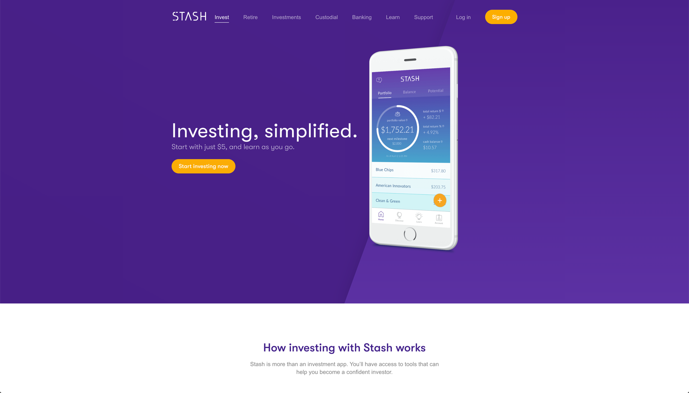
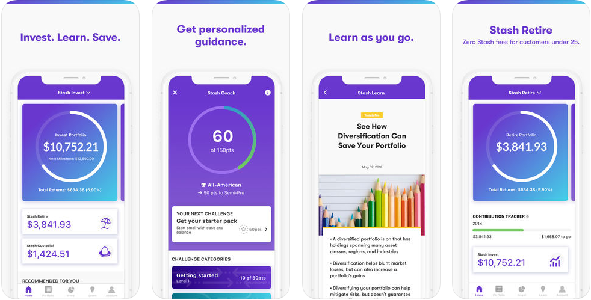

# Stash

[Stash](https://www.stashinvest.com/) is a well-designed mobile application aimed at making long term investing accessible people of all income levels.  Rooted in systematic savings, with a Stash account you will link your checking account to the application and will establish recurring transfers on a monthly basis to help fund you investment portfolio.  Those funds will be invested into specifically selected ETFs based on market sectors and investment thesis.  With the application you can use available screens to see investment account balance projections and how the amount you save every month with change those projections to help you set goals and plan for the future.  Well designed and with very low investment thresholds ($5 min) you can quickly establish a long term investment account from your phone and be off to the races.

## In Brief

* Setup monthly deposits and invest the collected funds in ETFs by theme or objective
* $5 minimum investment
* $1/month account fee if you have less than $5K, 0.25% annually if your account is more than $5K
* Can't buy individual stocks, or ETFs not listed on the platform


**Pro Tip:** description


## Is this app for me?

If you are just starting to save and have little experience with investing, Stash is a great way to get started.  Low account minimums and a reasonable selection of ETF options and you can be responsibly investing from your phone in no time at all.  If you are looking to do complex trades in individual equities, or would like other funding options for your account, you should look elsewhere.

## What does it do?

* Automated transfers to fund an investment account
* Low cost ETFs (and a few select individual stocks) for investment
* Low account fees

## What it lacks

This is not a wealth management platform.  It is also not a savings platform in the traditional sense (no setting goals or round-ups).  There are few resources to help you with budgeting and or cashflow management - instead you are offered a very well-designed approach to investing the proven ETFs (and some select stocks) with very low minimum investments.

## How to get started

1. Download their app from the app store, or setup a web based account at stashinvest.com
2. Setup your account using your email/mobile number
3. Determine your investor profile
4. Fund your account from an active checking account

## App Ratings and Details

The mobile versions of the application are well regarded, with 20K reviews and 4.8 stars on the Android store and 4.7 stars and 93K reviews on iOS.
