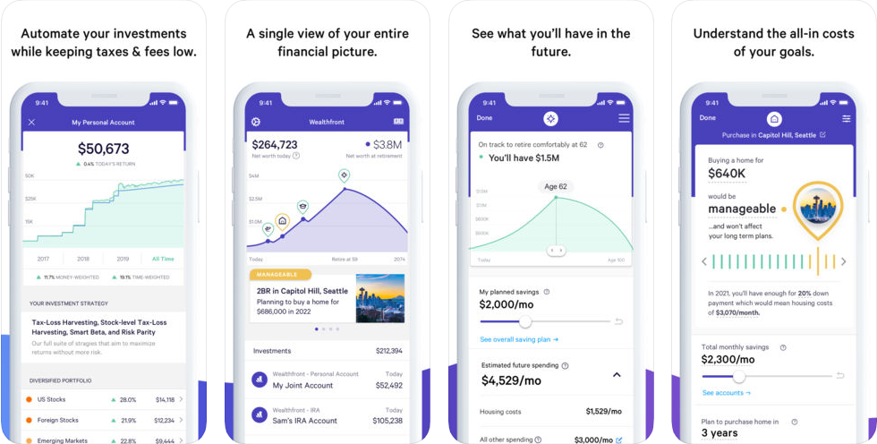

# Wealthfront

[Wealthfront](https://www.wealthfront.com/) Description

## In Brief

* Item
* Item
* Item


**Pro Tip:** description


## Is this app for me?

Text

## What does it do?

* Item
* Item
* Item

## What it lacks

Text

## How to get started

1. Item
2. Item

## App Ratings and Details

Truebill is available on both iOS and Android, both of which have high ratings and frequent updates.



The iOS version is frequently updated and offers a well designed user experience, including all the features described above.

| Rating | Price | Frequency of Updates |
| :--- | :--- | :--- |
| 4.7 / 5.0 ⭐ | Free, with in-app purchases | High |


[Download](https://itunes.apple.com/us/app/truebill-budget-bill-tracker/id1130616675?mt=8)




The Android version is frequently updated and offers a well designed user experience, including all the features described above.

| Rating | Price | Frequency of Updates |
| :--- | :--- | :--- |
| 4.1 / 5.0 ⭐ | Free, with in-app purchases | High |


[Download](https://play.google.com/store/apps/details?id=com.truebill&hl=en_US)




The website version offers a very basic summary of your Subscriptions, Bills, and Utilities.


